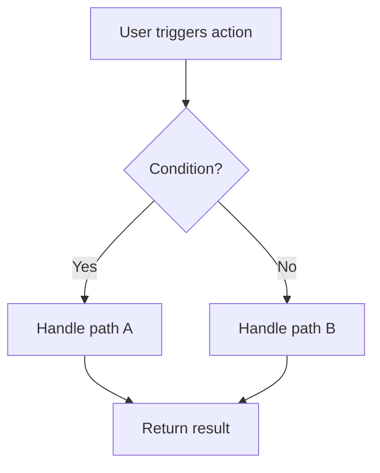
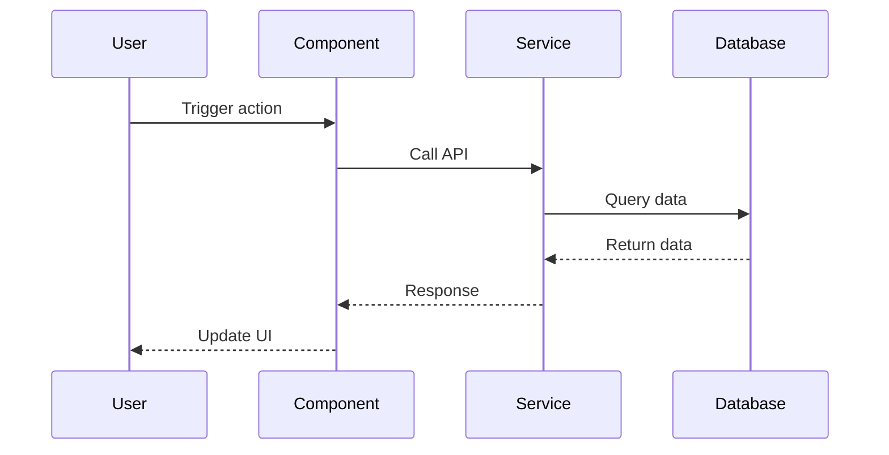
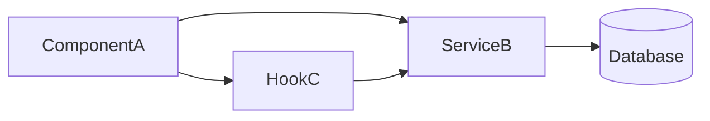
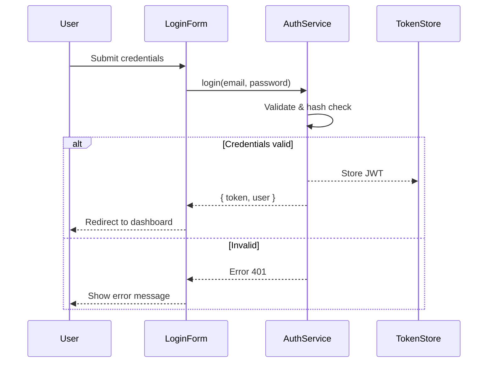

# Diagram Guide

Defines how to create `[feature-name].diagram.md` in Phase 4.

---

## File Structure

```markdown
# Diagram: [Feature Name]

> **Generated:** [date]
> **Related plan:** [feature-name].plan.md

---

## Files Affected

| File | Action | Notes |
|------|--------|-------|
| `path/to/file.ts` | 🟢 Create | [brief description] |
| `path/to/other.ts` | 🟡 Modify | [what changes] |
| `path/to/old.ts`   | 🔴 Delete | [reason for removal] |

---

## Flow Diagram

[Mermaid diagram goes here]

---

## Notes

[Notes on special points in the flow that the diagram can't fully express]
```

---

## Choosing the Right Diagram Type

### Flowchart — use when there is branching logic or conditions


### Sequence Diagram — use when multiple services or components communicate


### Component Diagram — use when describing relationships between modules


---

## Diagram Principles

1. **Keep it simple** — max 8–10 nodes per diagram. If more complex, split into 2 diagrams
2. **Use real names** — label nodes with actual component/file names, not generic A/B/C placeholders
3. **Annotate arrows** — if data is passed or a condition applies, label the arrow explicitly
4. **Match type to content** — Sequence for API calls, Flowchart for business logic, Component for architecture
5. **Add Notes** for anything the diagram can't express clearly on its own

---

## Real-World Example

### Feature: User Authentication


